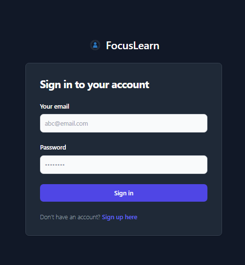
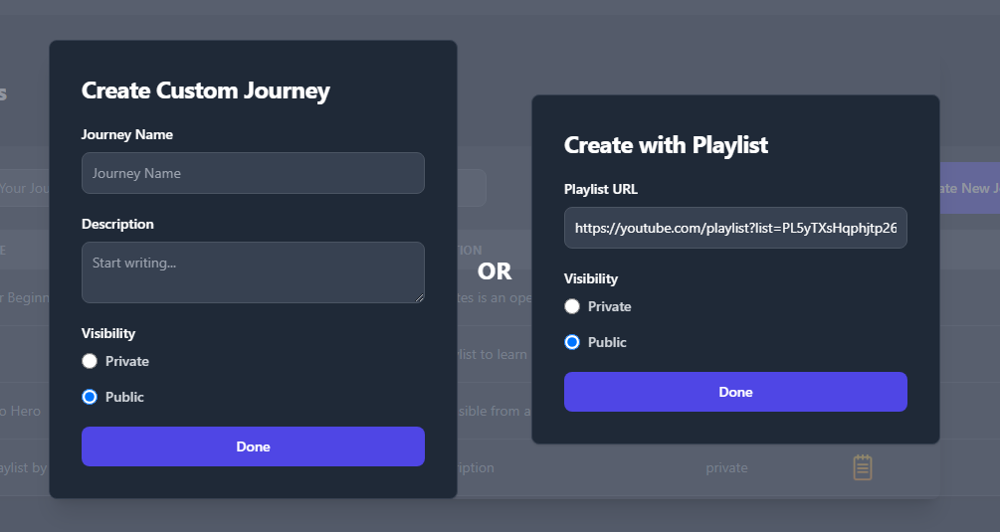
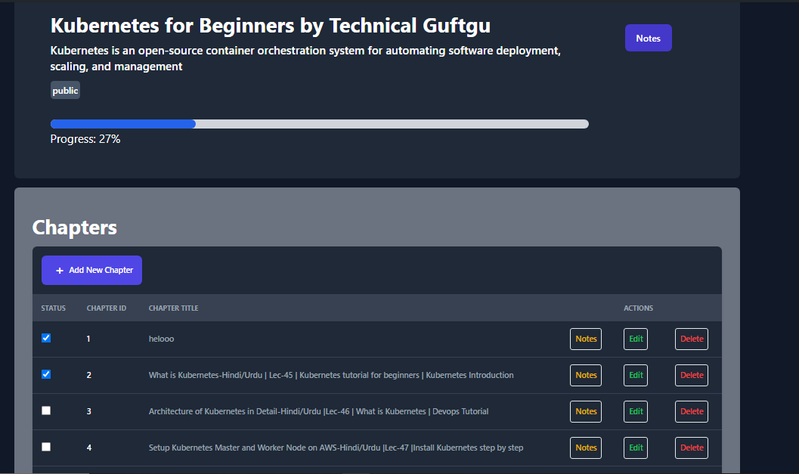
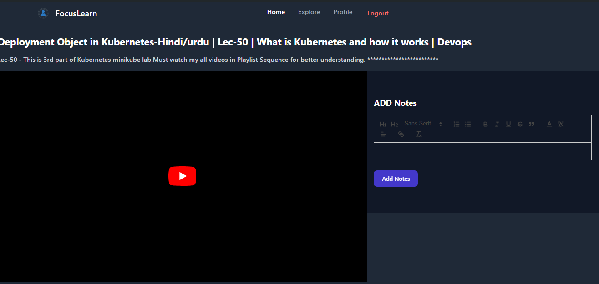
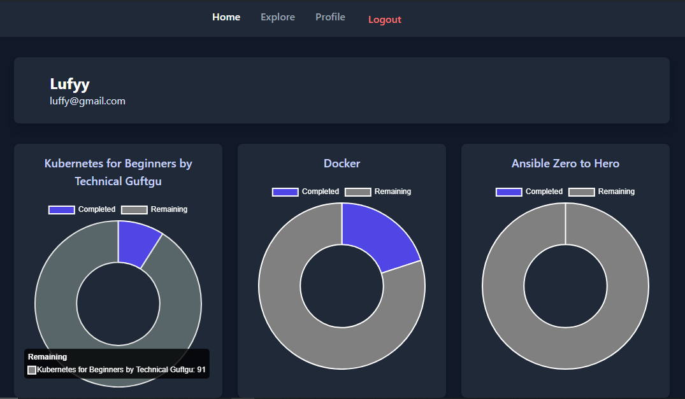
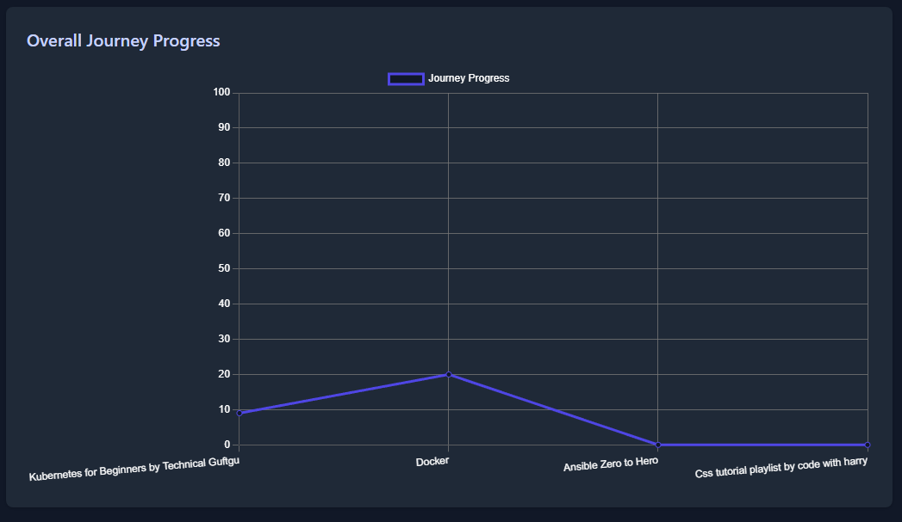
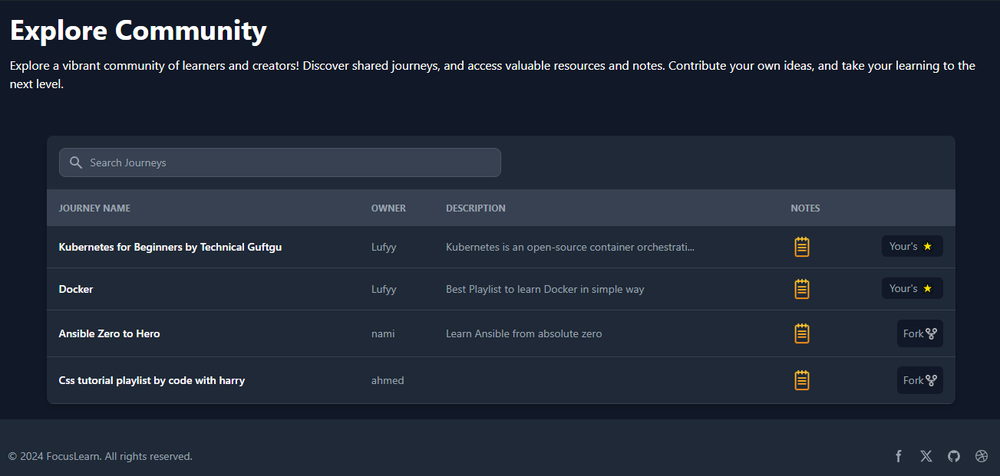

# Focus Learn

## Description

This project is a comprehensive platform designed to create and  manage educational materials efficiently. It provides a unified solution for users seeking a distraction-free learning environment, enabling easy management of educational content, notes, and personal progress. The platform includes several key features:

- **User Authentication**: Secure registration and login system to manage user accounts and access controls.

### Login Page


- **Journey Management**: Allows users to create their own journeys and can add youtube videos, orelse just add url of youtube playlist it will automatically provides you list of chapters.
### Create New Journey


### Journey Page



- **Video Playback**: Integrated video player to view youtube videos without the distractions typically found on platforms like YouTube and beside which you can also take notes.

- **Note-Taking**: Users can add and download notes related to their journeys, ensuring all important information is easily accessible.
### Video Player and Notes Taking



- **Profile Dashboard**: Provides an overview of user progress with visualizations such as charts and graphs.

### Progress Charts


### Overall Progress Graph


- **Fork Other's Journeys**: You can also fork other's journeys to your's which are set to public and other's can also fork your's.


### Forking Journeys



### Journey Forking

Users can:

- **Fork Journeys**: Duplicate public journeys to customize and tailor the content for personal use or further study.
- **Manage Forks**: Keep track of their own versions of journeys, separate from the original, while still retaining access to the source material.

## Setup

To get started with this project, follow these steps:

### Prerequisites

Make sure you have the following installed:

- Node.js (version 14 or higher)
- npm (version 6 or higher) or Yarn
- MySQL or another compatible database

### Installation

1. **Clone the repository:**

    ```bash
    git clone https://github.com/mdnumanraza/focusLearn.git
    cd focusLearn
    ```

2. **Install dependencies:**

    ```bash
    npm install
    ```

3. **Set up environment variables:**

    Create a `.env` file in the root directory of the api and reffer `.env.example` file for env variables

4. **Start the development server:**

    ```bash
    npm start
    ```

    The application should now be running at `http://localhost:5173`.

## Usage

### Authentication

- **Login/Register**: Navigate to `/auth` to login if you don't have account click on signup.

### Managing Journeys

- **Explore Journeys**: View and explore public journeys on the `/explore` page.
- **Fork Journeys**: Fork a journey to your account using the 'Fork' button.


### Profile Management

- **View Profile**: View your profile on the `/profile` page.
- **Track Progress**: Visualize your learning progress with charts and graphs.

## Contributing

If you'd like to contribute to the project, please fork the repository and submit a pull request.


## Contact

For any inquiries or issues, please contact [mohammednuman71417@gmail.com](mailto:mohammednuman71417@gmail.com).
